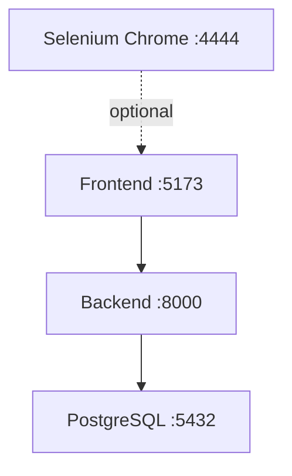

# GUI Testing Guide

This document provides a comprehensive guide to GUI testing in the Model Registry project using Selenium WebDriver.

## Overview

The GUI testing suite uses Selenium WebDriver to automate browser interactions and verify the frontend functionality. Tests cover:

- **Search functionality** (10 tests)
- **Package upload/ingestion** (11 tests)
- **HuggingFace model ingestion** (10 tests)
- **Authentication** (10 tests)

**Total: 41 GUI tests**

## Quick Start

### Option 1: Using Helper Script (Recommended)

```bash
# Run all tests with Docker
./run_gui_tests.sh

# Run with visible browser (debugging)
./run_gui_tests.sh --visible

# Run specific test
./run_gui_tests.sh --test test_search_packages.py
```

### Option 2: Manual Execution

```bash
# Start services
docker-compose up -d

# Run tests
HEADLESS=true PYTHONPATH=. python -m pytest tests/gui/ -v

# Cleanup
docker-compose down
```

## Architecture

### Test Structure

```
tests/gui/
├── base_test.py                  # Base class with utilities
├── test_search_packages.py       # Search functionality
├── test_upload_package.py        # Upload/ingest page
├── test_ingest_huggingface.py   # HuggingFace ingestion
├── test_authentication.py        # Login/logout tests
├── screenshots/                  # Auto-captured on failure
└── README.md                     # Detailed documentation
```

### Base Test Class

All tests inherit from `BaseGUITest` which provides:

- **Automatic setup/teardown** of Chrome WebDriver
- **Configurable environment** (URLs, headless mode)
- **Utility methods**:
  - `wait_for_element()` - Wait for element presence
  - `wait_for_clickable()` - Wait for element to be clickable
  - `wait_for_text()` - Wait for specific text
  - `take_screenshot()` - Capture screenshot
  - `wait_for_page_load()` - Wait for page ready state

### Configuration

Set via environment variables:

```bash
export FRONTEND_URL="http://localhost:5173"  # Frontend URL
export API_URL="http://localhost:8000"       # Backend API URL
export HEADLESS="true"                        # Run headless
```

## Docker Stack

The `docker-compose.yml` provides a complete testing environment:

### Services

1. **PostgreSQL Database** (port 5432)
   - Persistent data storage
   - Health checks enabled

2. **Backend API** (port 8000)
   - FastAPI application
   - Auto-reload enabled
   - Health endpoint: `/health`

3. **Frontend** (port 5173)
   - React + Vite dev server
   - Hot module replacement

4. **Selenium Chrome** (port 4444) *[optional]*
   - Remote WebDriver
   - VNC viewer on port 7900
   - Use with `--profile testing`

### Service Dependencies



### Health Checks

All services include health checks:

```bash
# Check service status
docker-compose ps

# View health check logs
docker-compose logs backend | grep health
```

## CI/CD Integration

### GitHub Actions Workflows

#### 1. GUI Tests Workflow (`.github/workflows/gui-tests.yml`)

Runs on:
- Pull requests to `main` or `develop`
- Changes to `front-end/**` or `tests/gui/**`
- Manual trigger via `workflow_dispatch`

Two test jobs:
- **gui-tests**: Direct execution (Chrome + services)
- **gui-tests-docker**: Using Docker stack

Features:
- Matrix testing (Python 3.11, Node 20)
- Screenshot capture on failure
- Log collection
- Artifact upload (7-day retention)
- Automatic cleanup

#### 2. Existing CI Workflow (`.github/workflows/ci.yml`)

Can be extended to include GUI tests:

```yaml
- name: Run GUI tests
  run: |
    # Start services
    docker-compose up -d
    # Run tests
    HEADLESS=true ./run_gui_tests.sh --no-docker
    # Cleanup
    docker-compose down
```

## Running Tests

### Local Development

**Start services manually:**

```bash
# Terminal 1: Backend
./run_api_new.sh

# Terminal 2: Frontend
cd front-end/model-registry-frontend
npm run dev

# Terminal 3: Tests
HEADLESS=false PYTHONPATH=. python -m pytest tests/gui/test_search_packages.py -v
```

**Use Docker:**

```bash
./run_gui_tests.sh --visible
```

### In CI/CD

Tests run automatically on pull requests. View results in GitHub Actions.

### Debugging Failed Tests

**1. Run with visible browser:**
```bash
./run_gui_tests.sh --visible
```

**2. Check screenshots:**
```bash
ls tests/gui/screenshots/
```

**3. View logs:**
```bash
# Docker logs
docker-compose logs backend
docker-compose logs frontend

# Application logs
cat logs/app.log
```

**4. Run single test:**
```bash
./run_gui_tests.sh --test test_search_packages.py --verbose
```

## Test Coverage

### Search Tests (test_search_packages.py)

- ✅ Page loads successfully
- ✅ Required UI elements present
- ✅ Search with empty query
- ✅ Search with package name
- ✅ Navigation links work
- ✅ Footer exists
- ✅ Responsive navbar
- ✅ Search results display
- ✅ Basic accessibility
- ✅ No critical console errors

### Upload/Ingest Tests (test_upload_package.py)

- ✅ Page navigation
- ✅ Form elements present
- ✅ File input exists
- ✅ URL input validation
- ✅ Submit button exists
- ✅ Form validation
- ✅ Multiple input fields
- ✅ Back navigation
- ✅ Page title
- ✅ Form styling
- ✅ Responsive design

### HuggingFace Ingestion Tests (test_ingest_huggingface.py)

- ✅ Navigate to ingest page
- ✅ HuggingFace URL input
- ✅ Valid URL format
- ✅ Multiple URL formats
- ✅ Ingest button clickable
- ✅ Form submission flow
- ✅ Invalid URL handling
- ✅ Page instructions
- ✅ Page layout
- ✅ Responsive design

### Authentication Tests (test_authentication.py)

- ✅ Check for login elements
- ✅ Application loads without auth
- ✅ Protected routes handling
- ✅ Login form (if exists)
- ✅ Logout functionality (if exists)
- ✅ Session persistence
- ✅ Unauthorized access handling
- ✅ Default admin credentials
- ✅ Auth token storage
- ✅ Auth headers in requests

## Best Practices

### Writing Tests

1. **Always use explicit waits**
   ```python
   # Good
   element = self.wait_for_element(By.ID, "submit-btn")

   # Bad
   time.sleep(5)
   element = self.driver.find_element(By.ID, "submit-btn")
   ```

2. **Test user workflows, not implementation**
   ```python
   # Good: Test the user journey
   def test_user_can_search_for_package(self):
       self.enter_search_term("bert")
       self.click_search_button()
       self.verify_results_displayed()

   # Bad: Testing implementation details
   def test_search_button_has_correct_css_class(self):
       btn = self.find_search_button()
       assert "btn-primary" in btn.get_attribute("class")
   ```

3. **Handle flakiness with retries**
   ```python
   @retry(max_attempts=3, delay=1)
   def test_dynamic_content(self):
       # Test that might be flaky
       pass
   ```

4. **Clean up test data**
   ```python
   def tearDown(self):
       # Clean up any test data created
       self.cleanup_test_packages()
       super().tearDown()
   ```

5. **Take screenshots on failure**
   ```python
   def tearDown(self):
       if sys.exc_info()[0]:
           self.take_screenshot(f"failure_{self._testMethodName}")
       super().tearDown()
   ```

### Performance

- Use `headless=true` in CI/CD
- Run tests in parallel when possible
- Use Docker for consistent environment
- Cache dependencies (pip, npm)

### Maintenance

- Keep selectors stable (prefer IDs/data-testid over classes)
- Update tests when UI changes
- Review and remove flaky tests
- Monitor test execution time

## Troubleshooting

### Common Issues

**ChromeDriver version mismatch:**
```bash
pip install --upgrade webdriver-manager
```

**Port already in use:**
```bash
sudo lsof -ti:8000 | xargs kill -9
sudo lsof -ti:5173 | xargs kill -9
```

**Tests timing out:**
- Increase timeout in `base_test.py`
- Check service health: `docker-compose ps`
- View logs: `docker-compose logs`

**Element not found:**
- Run with `HEADLESS=false` to see the browser
- Take screenshots: `self.take_screenshot("debug")`
- Check element selectors in browser DevTools

**Docker issues:**
```bash
# Reset everything
docker-compose down -v
docker-compose up -d

# Check service health
docker-compose ps
```

## Future Enhancements

- [ ] Visual regression testing (Percy, BackstopJS)
- [ ] Cross-browser testing (Firefox, Safari, Edge)
- [ ] Mobile responsiveness testing
- [ ] Performance monitoring (Lighthouse)
- [ ] Accessibility testing (axe-selenium)
- [ ] Page Object Model pattern
- [ ] Parallel test execution
- [ ] Video recording of test runs

## References

- [Selenium Documentation](https://selenium-python.readthedocs.io/)
- [WebDriver Manager](https://github.com/SergeyPirogov/webdriver_manager)
- [pytest Documentation](https://docs.pytest.org/)
- [Docker Compose Documentation](https://docs.docker.com/compose/)
- [GitHub Actions Documentation](https://docs.github.com/en/actions)

## Support

For issues or questions:
1. Check `tests/gui/README.md` for detailed information
2. Review GitHub Actions logs for CI failures
3. Open an issue on GitHub with:
   - Test output
   - Screenshots (if available)
   - Service logs
   - Environment details
